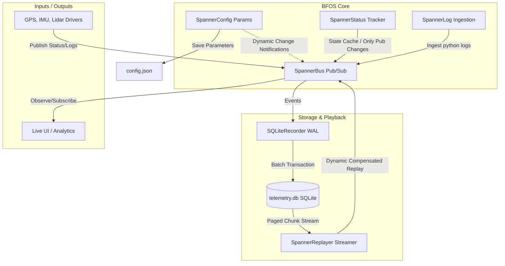

# Bag Full of Spanners (BFOS) 🔧🚢

**Bag Full of Spanners (BFOS)** is an ultra-lightweight, high-performance, asynchronous telemetry and control bus written in pure Python. It is designed specifically for resource-constrained systems such as autonomous mobile robots, robotic lawn mowers, and edge computing nodes where reliability, deterministic replay, and low dependency footprints are paramount.

BFOS separates runtime parameters, telemetry status, structured logging, and control channels into cohesive concepts on a single high-performance asyncio bus.

---

## Key Features

- **Zero External Dependencies:** Built entirely with Python's standard library (`asyncio`, `sqlite3`, `ctypes`, etc.).
- **High-Performance Pub/Sub:** Dynamic subscription wildcard support (`+` and `#`) with a matching engine optimized down to $O(1)$ performance using runtime subscription caching.
- **Dynamic Telemetry & Status:** High-fidelity state tracking that dynamically publishes updates to the bus only when values change.
- **Fail-Safe Configurations:** Disk parameters with atomic writes ensuring parameter sets remain perfectly uncorrupted even during sudden power losses or device disk-full scenarios.
- **High-Throughput Recording:** Batch-writing sqlite logging inside WAL (Write-Ahead Logging) mode, achieving over **22,000 writes/sec** in concurrent environments.
- **Drift-Compensated Replay:** Accurate chronological replay of sensor streams, with drift compensation adjusting scheduler sleep margins dynamically to preserve original timings (retaining clock precision to under 1.0ms offset).

---

## Architectural Breakdown



---

## Quick Start

### Installation

No installation required! Just copy the `bfos` directory into your project. Make sure you are using Python 3.10+ and `asyncio`.

### Basic Usage

```python
import asyncio
from bfos import SpannerBus, SpannerStatus

async def main():
    # Initialize the high-performance bus
    bus = SpannerBus()

    # Define a subscriber callback
    async def gps_callback(topic, payload):
        print(f"Received from {topic}: {payload}")

    # Subscribe to status changes using wildcards
    await bus.subscribe("status/gps/#", gps_callback)

    # Initialize a telemetry status tracker
    status = SpannerStatus(bus, "status/gps")

    # Update state - automatically publishes to 'status/gps/position'
    await status.set("position", {"lat": 59.91, "lon": 10.75})

    # Only publishes if value changes
    await status.set("position", {"lat": 59.91, "lon": 10.75})  # Skipped!

# Run within asyncio loop
asyncio.run(main())
```

### Recording and Playback

```python
import asyncio
from bfos import SpannerBus, SQLiteRecorder, SpannerReplayer

async def run_mission():
    bus = SpannerBus()
    
    # Start writing all events chronologically to SQLite
    async with SQLiteRecorder(bus, "mission_log.db") as recorder:
        await bus.publish("sensor/imu", {"yaw": 182.4, "pitch": 1.2})
        await asyncio.sleep(0.1)
        await bus.publish("sensor/gps", {"speed": 4.2})

async def replay_mission():
    bus = SpannerBus()
    
    # Create subscriber to watch replayed stream
    async def watcher(topic, payload):
        print(f"[Replay] {topic} -> {payload}")
        
    await bus.subscribe("#", watcher)
    
    # Play back with 2x speed-up factor
    replayer = SpannerReplayer(bus, "mission_log.db")
    await replayer.play(speed_factor=2.0)
```

---

## Development & Quality Assurance

A Makefile is provided for basic developer commands:

```bash
# Display help and options
make help

# Run the complete test suite (includes performance and stress testing)
make test

# Run a real-time concurrent device simulation (GPS, IMU, Battery drivers)
make simulation

# Clean caching directories and test databases
make clean
```

---

## License

This project is licensed under the **MIT License**. See `bfos` source files for details.
